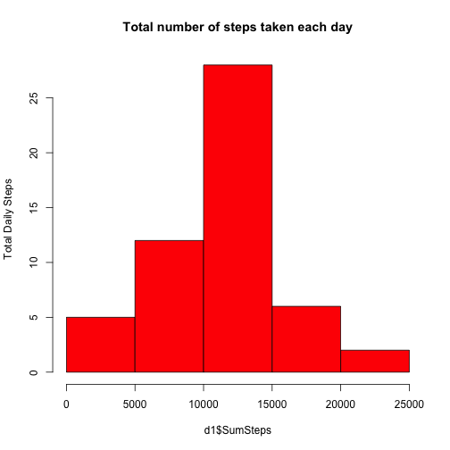
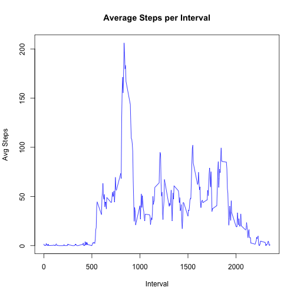
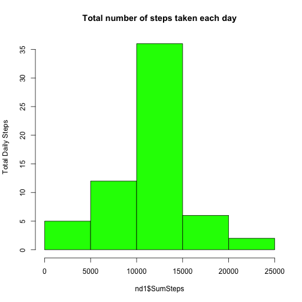
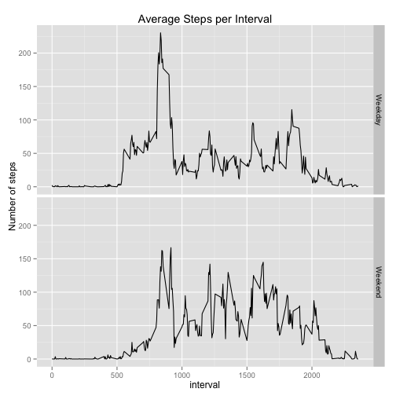

#Assignment

This assignment will be described in multiple parts. You will need to write a report that answers the questions detailed below. Ultimately, you will need to complete the entire assignment in a single R markdown document that can be processed by knitr and be transformed into an HTML file.

For further details please refer to ReadMe file.


Read Data

```r
setwd("~/datasciencecoursera/5 - Reproducible Research/PA1")
data <- read.csv("activity.csv", colClasses = "character")
str(data)
```

```
## 'data.frame':	17568 obs. of  3 variables:
##  $ steps   : chr  NA NA NA NA ...
##  $ date    : chr  "2012-10-01" "2012-10-01" "2012-10-01" "2012-10-01" ...
##  $ interval: chr  "0" "5" "10" "15" ...
```


Process/transform the data into a format suitable for your analysis

```r
data$steps <- as.numeric(data$steps)
data$date <- as.Date(data$date)
data$interval <- as.numeric(data$interval)
str(data)
```

```
## 'data.frame':	17568 obs. of  3 variables:
##  $ steps   : num  NA NA NA NA NA NA NA NA NA NA ...
##  $ date    : Date, format: "2012-10-01" "2012-10-01" ...
##  $ interval: num  0 5 10 15 20 25 30 35 40 45 ...
```

###What is mean total number of steps taken per day?

For this part of the assignment, you can ignore the missing values in the dataset.

1 - Make a histogram of the total number of steps taken each day


```r
d1 <- aggregate.data.frame(data$steps, list(data$date), sum)
names(d1) <- c("dates","SumSteps") 


hist(d1$SumSteps, freq=TRUE, ylab="Total Daily Steps", main="Total number of steps taken each day", col="red")
```

 

2 - Calculate and report the mean and median total number of steps taken per day


```r
mean(d1$SumSteps, na.rm=TRUE)
```

```
## [1] 10766.19
```

```r
median(d1$SumSteps, na.rm=TRUE)
```

```
## [1] 10765
```


###What is the average daily activity pattern?

1 - Make a time series plot (i.e. type = "l") of the 5-minute interval (x-axis) and the average number of steps taken, averaged across all days (y-axis)


```r
x <- subset(data,data$steps>=0)
AV <- aggregate.data.frame(x$steps, list(x$interval), mean)
names(AV) <- c("interval","AvgSteps") 

plot(AV$interval,AV$AvgSteps,type="l", ylab="Avg Steps",xlab = "Interval", col = "blue")
title("Average Steps per Interval")
```

 

2 - Which 5-minute interval, on average across all the days in the dataset, contains the maximum number of steps?


```r
subset(AV,AV$AvgSteps>=max(AV$AvgSteps))
```

```
##     interval AvgSteps
## 104      835 206.1698
```


###Imputing missing values

Note that there are a number of days/intervals where there are missing values (coded as NA). The presence of missing days may introduce bias into some calculations or summaries of the data.

1 - Calculate and report the total number of missing values in the dataset (i.e. the total number of rows with NAs)

```r
sum(is.na(data$step))
```

```
## [1] 2304
```

2 - Devise a strategy for filling in all of the missing values in the dataset. The strategy does not need to be sophisticated. For example, you could use the mean/median for that day, or the mean for that 5-minute interval, etc.

    The strategy I devise for filling in all the missing values in the dataset is to use the mean value for the 5-minute interval.


3 - Create a new dataset that is equal to the original dataset but with the missing data filled in.


```r
## Create a new dataset with  new column ImpVal to filled in missing values
m <- data
m$ImpVal <- -1 

## set up loop length
a <- dim(m)
b <- a[1]

## Display reference data to follow up how the loop works
b
```

```
## [1] 17568
```

```r
head(m)
```

```
##   steps       date interval ImpVal
## 1    NA 2012-10-01        0     -1
## 2    NA 2012-10-01        5     -1
## 3    NA 2012-10-01       10     -1
## 4    NA 2012-10-01       15     -1
## 5    NA 2012-10-01       20     -1
## 6    NA 2012-10-01       25     -1
```

```r
head(AV)
```

```
##   interval  AvgSteps
## 1        0 1.7169811
## 2        5 0.3396226
## 3       10 0.1320755
## 4       15 0.1509434
## 5       20 0.0754717
## 6       25 2.0943396
```

```r
## loop to populate the ImpVal Column with Avg per interval
 for (i in 1:b)
         {
            if (is.na(m[i,1])) { 
                AvgInterval =  AV[AV$interval==m[i,3],2] 
                m[i,4] <- AvgInterval
                              }
            else { m[i,4] <- m[i,1]}
                    }
## Result
head(m)
```

```
##   steps       date interval    ImpVal
## 1    NA 2012-10-01        0 1.7169811
## 2    NA 2012-10-01        5 0.3396226
## 3    NA 2012-10-01       10 0.1320755
## 4    NA 2012-10-01       15 0.1509434
## 5    NA 2012-10-01       20 0.0754717
## 6    NA 2012-10-01       25 2.0943396
```


4 - Make a histogram of the total number of steps taken each day and Calculate and report the mean and median total number of steps taken per day. Do these values differ from the estimates from the first part of the assignment? What is the impact of imputing missing data on the estimates of the total daily number of steps?


```r
nd1 <- aggregate.data.frame(m$ImpVal, list(m$date), sum)
names(nd1) <- c("dates","SumSteps") 

hist(nd1$SumSteps, freq=TRUE, ylab="Total Daily Steps", main="Total number of steps taken each day", 
                    col="green")
```

 


###Are there differences in activity patterns between weekdays and weekends?

For this part the weekdays() function may be of some help here. Use the dataset with the filled-in missing values for this part.

1 - Create a new factor variable in the dataset with two levels – “weekday” and “weekend” indicating whether a given date is a weekday or weekend day.


```r
m$day <- ifelse(!weekdays(as.Date(m[,2])) %in% c("Saturday", "Sunday"),
       "weekday","weekend")
```


2 - Make a panel plot containing a time series plot (i.e. type = "l") of the 5-minute interval (x-axis) and the average number of steps taken, averaged across all weekday days or weekend days (y-axis). The plot should look something like the following, which was creating using simulated data:

  


```r
y <- subset(m,m$day=="weekday")
AVWD <- aggregate.data.frame(y$ImpVal, list(y$interval), mean)
names(AVWD) <- c("interval","AvgSteps") 

z <- subset(m,m$day=="weekend")
AVWE <- aggregate.data.frame(z$ImpVal, list(z$interval), mean)
names(AVWE) <- c("interval","AvgSteps") 

newdata <- AVWD
newdata$daytype <- 'Weekday' 
r <- AVWE
r$daytype <- 'Weekend' 
newdata <- rbind(newdata,r)

library(ggplot2)
qplot(interval,AvgSteps,data=newdata,facets=daytype~., geom="line", 
      ylab="Number of steps", main="Average Steps per Interval")
```

 


End of Report
